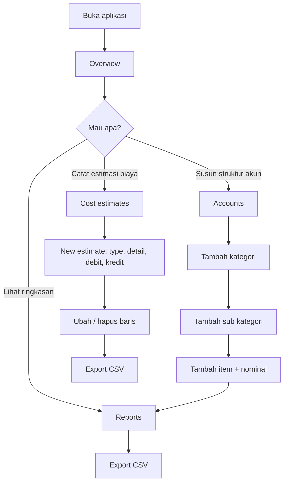
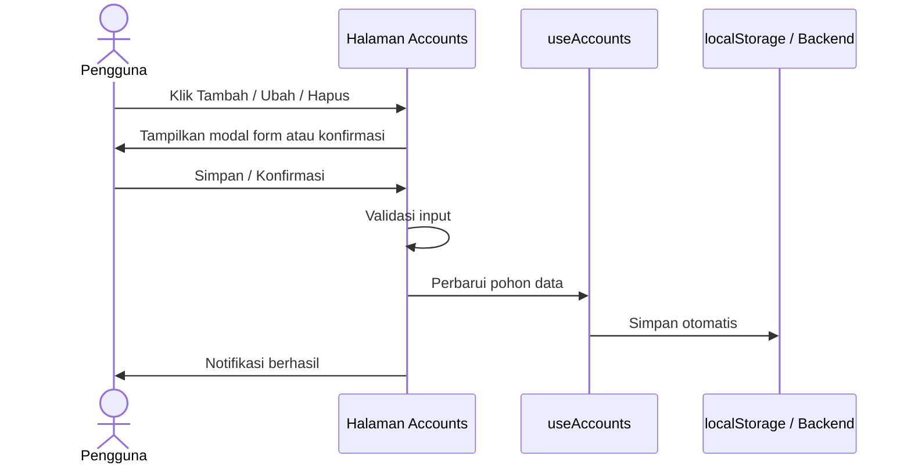
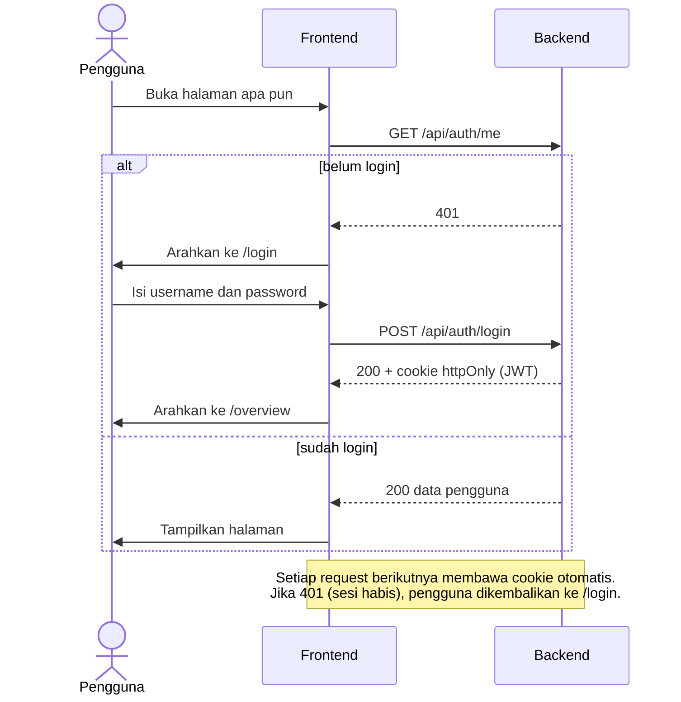
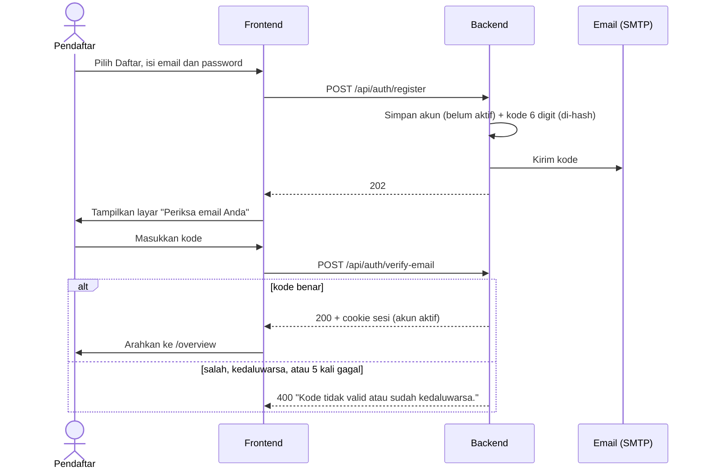

# my-dashboard

Dashboard pengelolaan estimasi biaya pribadi (Costly). Terdiri dari **frontend** (UI) dan **backend** (API opsional untuk menyimpan data Accounts).

---

## 1. Tech Stack

### Frontend (`frontend/`)

| Aspek | Teknologi |
|---|---|
| Framework | **Next.js 16** (App Router, Turbopack) |
| Library UI | **React 19** |
| Bahasa | **JavaScript (JSX)**, tanpa TypeScript. Alias impor `@/` diatur di `jsconfig.json` |
| Styling | **Tailwind CSS 4** + CSS biasa (`app/globals.css`, `styles/accounts.css`) |
| Ikon | **lucide-react** |
| Komponen dasar | shadcn/ui (`components/ui/button.jsx`), class-variance-authority, tailwind-merge |
| Penyimpanan data | `localStorage` browser (default) atau backend lewat REST API |
| Package manager | pnpm |
| Runtime | Node.js 20.9+ |

### Backend (`backend/`)

| Aspek | Teknologi |
|---|---|
| Framework | **Spring Boot 3.4** |
| Bahasa | **Java 21** |
| Akses data | Spring Data JPA (Hibernate) |
| Migrasi database | **Flyway** (satu file migrasi per fitur) |
| Database | **PostgreSQL 16** |
| Validasi | Jakarta Bean Validation |
| Keamanan | **Spring Security** (stateless), **JWT** (JJWT 0.12) di cookie httpOnly, hash password **BCrypt** |
| Email | **Spring Mail** (SMTP) untuk kode verifikasi; verifikasi ID token Google lewat endpoint tokeninfo |
| Build | Maven |

> Login sudah ada. Pengelolaan banyak pengguna (daftar, kelola role) belum ada.

---

## 2. Struktur Folder

```
frontend/
  app/            route tipis: overview, cost-estimates, accounts, reports
  views/          isi halaman (overviewPage, costEstimatesPage, accountsPage, reportsPage)
  components/
    layout/       appShell, sidebar, topbar
    common/       modal, popover, confirmDialog, toastProvider, metricCard, pageFooter
    accounts/     categoryCard, accountFormModal
    estimates/    estimateFormModal
    auth/         authProvider, authGate, changePasswordModal, dan bagian halaman login
                  (loginHeader, credentialsPanel, verifyCodeForm, googleSignInButton, loginAside, formMessage)
    landing/      bagian landing page (hero, problem, features, steps, security, faq, cta) dan scrollEffects
    ui/           komponen dasar shadcn
  hooks/          useAccounts, useEstimates, useStoredState
  services/       apiClient, accountsService, estimatesService (API backend)
  lib/            accountsTree, formatters, exportCsv, createId, resetAppData
  data/           mockData, navigation
  styles/         CSS per fungsi (lihat bagian "Panduan CSS" di bawah)
    base/         tokens, base
    components/   avatar, buttons, panel, metricCard, table, emptyState, form, modal, popover, toast, pageFooter
    layout/       pageLayout, sidebar, topbar
    pages/        overview, costEstimates, accounts, reports, login, landing, landingMotion
    index.js      urutan impor semua CSS

backend/                         (satu paket per fitur)
  pom.xml  Dockerfile            Dockerfile = wadah deploy (belum dipakai)
  src/main/java/com/mydashboard/
    MyDashboardApplication.java
    common/                      config (CORS) dan exception (error handler) bersama
    account/                     kategori -> sub kategori -> item
    costestimate/                estimasi biaya (debit/kredit)
    overview/                    ringkasan; hanya membaca lewat service fitur lain
    profile/                     profil pengguna
    auth/                        login, daftar + verifikasi email, login Google, JWT, Spring Security, pembatas percobaan, pengirim email
    user/                        entitas pengguna, role, dan pembuatan admin pertama
  src/main/resources/
    application.yml
    db/migration/                V1 account, V2 costestimate, V3 profile, V4 users, V5 email dan verifikasi

  Isi tiap paket fitur: Controller, Service, Repository, Entity, Dtos.
```

### Panduan CSS (frontend)

Mau ubah tampilan? Cari file berdasarkan bagian yang ingin diubah:

| Yang ingin diubah | File |
|---|---|
| Warna dasar, font, reset | `styles/base/tokens.css`, `styles/base/base.css` |
| Tombol (semua jenis, ikon aksi) | `styles/components/buttons.css` |
| Kartu panel dan judul panel | `styles/components/panel.css` |
| Kartu metrik | `styles/components/metricCard.css` |
| Tabel umum | `styles/components/table.css` |
| Modal, form, popover, toast, footer | `styles/components/` (nama file sesuai komponen) |
| Sidebar / topbar / kerangka halaman | `styles/layout/sidebar.css`, `topbar.css`, `pageLayout.css` |
| Landing page: warna, tata letak, teks | `styles/pages/landing.css` |
| Landing page: semua animasi (reveal, blur, parallax, progres) | `styles/pages/landingMotion.css` |
| Halaman login: kerangka, form, tombol, pesan | `styles/pages/login.css` |
| Halaman login: panel kanan beranimasi (blur melayang, kalimat bergantian) | `styles/pages/loginAside.css` |
| Halaman Overview / Cost estimates / Accounts / Reports | `styles/pages/` (nama file sesuai halaman) |

Aturan:
- Tambah gaya baru ke file yang sesuai fungsinya. Jika belum ada, buat file baru dan daftarkan di `styles/index.js`.
- **Urutan impor di `styles/index.js` menentukan kaskade CSS**: base, komponen, layout, lalu halaman. Jangan diubah sembarangan.
- `app/globals.css` hanya berisi entry Tailwind/shadcn. Jangan menaruh gaya aplikasi di sana.
- Nama class masih global (bukan CSS Modules), jadi beri nama yang spesifik agar tidak bentrok.

### Landing page (`/`)

Halaman publik untuk memperkenalkan sistem. Struktur: Hero → Masalah → Fitur → Cara kerja → Keamanan → FAQ → ajakan login.

- **Isi:** satu komponen per bagian di `components/landing/`. Ubah teks langsung di file bagian terkait.
- **Gradasi antar bagian:** setiap bagian memakai `--from` dan `--to` di `landing.css`. Nilai `--to` sebuah bagian harus sama dengan `--from` bagian berikutnya agar transisinya mulus.
- **Animasi:** elemen bertanda `data-reveal` muncul dengan fade + blur saat masuk layar. Variasi: `data-reveal="fade|left|right|zoom"`, jeda lewat `style={delay(ms)}`. Hero memudar dan blur saat di-scroll. Ada bilah progres di atas dan header kaca.
- **Aksesibilitas:** mengikuti `prefers-reduced-motion` (semua langsung tampil tanpa animasi) dan tetap terbaca tanpa JavaScript.
- **Tombol login:** `loginLink.jsx` menampilkan "Masuk" / "Klik untuk Login" bila belum login, dan "Buka dashboard" bila sudah login atau saat mode lokal.
- **Isi bersifat apa adanya:** tidak ada testimoni, angka pengguna, atau klaim fitur yang belum ada. Pertahankan prinsip ini saat mengubah teks.

### Header keamanan (frontend)
`next.config.mjs` menambahkan `X-Content-Type-Options`, `X-Frame-Options: DENY`, `Referrer-Policy`, `Permissions-Policy`,
dan `Strict-Transport-Security` (hanya produksi). Content-Security-Policy belum dipasang (lihat batasan).

---

## 3. Menjalankan

```bash
# Frontend  ->  http://localhost:3000
cd frontend && pnpm install && pnpm dev

# Backend (opsional)  ->  http://localhost:4000 (butuh Java 21, Maven, Docker)
docker compose up -d db && cd backend && mvn spring-boot:run
```

Memakai backend: salin `frontend/.env.example` menjadi `frontend/.env.local`, lalu isi
`NEXT_PUBLIC_API_URL=http://localhost:4000`. Jika kosong, frontend memakai `localStorage`.

### Database lokal (PostgreSQL, nama `db_project`)

```bash
docker compose up -d db          # membuat database db_project di Postgres 16
cd backend && mvn spring-boot:run  # Flyway membuat semua tabel otomatis (V1-V3)
```

Tanpa Docker: buat database sekali lewat `CREATE DATABASE db_project;`, lalu sesuaikan
`DB_URL`, `DB_USER`, `DB_PASSWORD` (lihat `backend/.env.example`). Postgres 13+ diperlukan (`gen_random_uuid()`).
Frontend mode backend: isi `NEXT_PUBLIC_API_URL=http://localhost:4000` di `frontend/.env.local`.

### Login

Backend **wajib** diberi `JWT_SECRET`; tanpa itu aplikasi sengaja menolak start. Akun admin pertama dibuat otomatis
dari variabel lingkungan, hanya jika tabel `users` masih kosong.

```bash
# Linux / macOS / Git Bash
export JWT_SECRET="$(openssl rand -base64 48)"
export APP_ADMIN_USERNAME=admin
export APP_ADMIN_PASSWORD='ganti-password-ini'   # minimal 8 karakter
cd backend && mvn spring-boot:run
```
```powershell
# Windows PowerShell
$env:JWT_SECRET = [Convert]::ToBase64String((1..48 | ForEach-Object { Get-Random -Maximum 256 }) -as [byte[]])
$env:APP_ADMIN_USERNAME = "admin"; $env:APP_ADMIN_PASSWORD = "ganti-password-ini"
cd backend; mvn spring-boot:run
```

- **Mode backend** (`NEXT_PUBLIC_API_URL` diisi): semua halaman butuh login, lalu diarahkan ke `/login`.
- **Mode lokal** (`NEXT_PUBLIC_API_URL` kosong): tidak ada login, data di `localStorage` seperti sebelumnya.
**Jika `mvn spring-boot:run` gagal dengan "cannot find symbol getXxx()" atau "variable ... not initialized in the default constructor":**
Lombok tidak berjalan. `pom.xml` sudah mendaftarkannya lewat `annotationProcessorPaths` (diperlukan di JDK 23+).
Pastikan `pom.xml` Anda versi terbaru, lalu jalankan `mvn clean spring-boot:run`. Cek versi Java dengan `java -version` dan `mvn -version`
(keduanya harus memakai JDK yang sama). JDK 21 atau 25 (LTS) paling aman.

- Tes lewat terminal: `curl -c cookie.txt -H "Content-Type: application/json" -d '{"username":"admin","password":"..."}' localhost:4000/api/auth/login`, lalu `curl -b cookie.txt localhost:4000/api/accounts`.

### Login, daftar, verifikasi email, dan Google

Halaman `/login` memakai tampilan dua kolom: form di kiri, panel dekoratif beranimasi di kanan.

| Fitur | Cara kerja | Aktif jika |
|---|---|---|
| Masuk | Email atau username + password | Selalu |
| Login Google | Tombol resmi Google; backend memverifikasi ID token | `GOOGLE_CLIENT_ID` diisi |
| Daftar | Email + password, lalu kode 6 digit dikirim ke email | `APP_REGISTRATION_ENABLED=true` |
| Verifikasi email | Kode berlaku 10 menit, maksimal 5 kali salah, kirim ulang tiap 60 detik | Mengikuti pendaftaran |

Tombol Google dan tautan "Daftar" otomatis disembunyikan jika fitur tidak aktif (frontend membaca `GET /api/auth/config`).

**Pendaftaran mandiri dimatikan secara bawaan.** Alasannya: data (Accounts, Cost estimates) masih satu set yang dilihat semua pengguna.
Selama belum dipisah per pengguna, siapa pun yang mendaftar akan melihat dan bisa mengubah data yang sama. Aktifkan hanya untuk uji coba.

Mengaktifkan pendaftaran:
```bash
export APP_REGISTRATION_ENABLED=true
# Pilih salah satu cara menerima kode:
export APP_DEV_LOG_CODES=true            # kode muncul di log backend (khusus pengembangan)
# atau atur SMTP (contoh Gmail memakai App Password):
export SPRING_MAIL_HOST=smtp.gmail.com SPRING_MAIL_PORT=587
export SPRING_MAIL_USERNAME=akun@gmail.com SPRING_MAIL_PASSWORD=app-password
export SPRING_MAIL_PROPERTIES_MAIL_SMTP_AUTH=true SPRING_MAIL_PROPERTIES_MAIL_SMTP_STARTTLS_ENABLE=true
export APP_MAIL_FROM=akun@gmail.com
```

Mengaktifkan login Google:
1. Di Google Cloud Console buat **OAuth client ID** bertipe *Web application*.
2. Pada *Authorized JavaScript origins* isi `http://localhost:3000` (dan domain Anda saat deploy).
3. Jalankan backend dengan `export GOOGLE_CLIENT_ID=xxxx.apps.googleusercontent.com`.
4. Jika nanti memasang Content-Security-Policy, izinkan `accounts.google.com` untuk skrip, frame, dan koneksi.

Tanpa pendaftaran terbuka, login Google hanya berlaku untuk email yang sudah terdaftar.

---

## 4. Alur untuk Business Analyst

### 4.1 Tujuan bisnis
Membantu pengguna menyusun dan memantau estimasi biaya bulanan, serta mengelola struktur akun
(kategori → sub kategori → item) sebagai dasar pelaporan.

### 4.2 Aktor
| Aktor | Peran |
|---|---|
| Admin | Pengguna terdaftar (role `ADMIN`); dibuat otomatis saat pertama kali backend berjalan |
| Pengguna | Pengguna terdaftar (role `USER`). Saat ini hak aksesnya sama dengan admin |
| Tamu | Belum login; hanya bisa membuka landing page dan halaman login |
| Pendaftar | Tamu yang sedang mendaftar dan belum memverifikasi email (belum bisa masuk) |

### 4.3 Daftar halaman dan fungsi

| Halaman | Route | Fungsi utama |
|---|---|---|
| Landing | `/` | Halaman publik: pengenalan, fitur, keamanan, FAQ, dan tombol login di bagian bawah |
| Login | `/login` | Masuk (email/username), daftar + verifikasi email, login Google (sesuai pengaturan server); keluar dan ubah password lewat menu profil |
| Overview | `/overview` | Ringkasan metrik, grafik bulanan, kategori teratas, estimasi terbaru, tambah estimasi, ekspor CSV |
| Cost estimates | `/cost-estimates` | Tabel debit/kredit/saldo; tambah, ubah, hapus baris; ekspor CSV |
| Accounts | `/accounts` | CRUD kategori → sub kategori → item, pencarian, ciutkan/buka semua |
| Reports | `/reports` | Porsi nominal per kategori dari data Accounts, ekspor CSV |

### 4.4 Alur pengguna utama



### 4.5 Alur CRUD Accounts



### 4.5b Alur login



### 4.5c Alur daftar dan verifikasi email



### 4.6 Aturan bisnis dan validasi

| Aturan | Keterangan |
|---|---|
| Hierarki | Kategori memiliki banyak sub kategori; sub kategori memiliki banyak item |
| Nama wajib | Kategori, sub kategori, dan item tidak boleh kosong |
| Nominal | Hanya item yang punya nominal; harus angka ≥ 0 |
| Total | Total sub kategori = jumlah item; total kategori = jumlah sub kategori (dihitung otomatis) |
| Hapus | Menghapus kategori atau sub kategori ikut menghapus seluruh isinya, dengan konfirmasi |
| Estimasi | `type` dan `detail` wajib; `debit` dan `credit` ≥ 0; saldo = credit − debit |
| Nama kembar | Belum divalidasi (nama yang sama diperbolehkan) |
| Akses | Semua endpoint selain login dan logout wajib login (`401` jika tidak) |
| Username | Disimpan huruf kecil dan harus unik |
| Password | Minimal 8 karakter, disimpan sebagai hash BCrypt, tidak pernah dikirim balik |
| Percobaan login | 5 kali gagal dalam 15 menit mengunci kombinasi username+IP selama 15 menit (`429`) |
| Sesi | Berlaku 8 jam (`TOKEN_TTL_MINUTES`), setelah itu harus login ulang |
| Akun pertama | Dibuat dari `APP_ADMIN_USERNAME` dan `APP_ADMIN_PASSWORD` hanya jika tabel pengguna kosong |
| Masuk | Boleh memakai email atau username |
| Pendaftaran | Hanya jika `APP_REGISTRATION_ENABLED=true`; email yang sudah terverifikasi tidak bisa didaftarkan lagi |
| Akun baru | Role `USER`, username dibuat dari bagian depan email, nonaktif sampai email diverifikasi |
| Kode verifikasi | 6 digit, berlaku 10 menit, disimpan sebagai hash, maksimal 5 kali salah, kirim ulang minimal 60 detik |
| Pendaftaran berulang | Pendaftaran yang belum terverifikasi boleh diulang (password dan kode diganti) |
| Login Google | Email harus terverifikasi oleh Google; akun baru hanya dibuat jika pendaftaran dibuka |

### 4.7 Model data

```
Category   { id, name, subs[] }
SubCategory{ id, name, items[] }
Item       { id, name, amount }
Estimate   { id, type, detail, debit, credit }
Profile    { fullName, email }
User       { id, username, email, emailVerified, passwordHash, fullName, role (ADMIN|USER), enabled }
```

### 4.8 Kontrak API (backend)

| Fitur | Method | Endpoint | Fungsi |
|---|---|---|---|
| Account | GET | `/api/accounts` | Seluruh pohon kategori → sub → item |
| Account | POST / PUT / DELETE | `/api/accounts/categories[/{id}]` | Tambah, ubah, hapus kategori |
| Account | POST | `/api/accounts/categories/{categoryId}/subs` | Tambah sub kategori |
| Account | PUT / DELETE | `/api/accounts/subs/{id}` | Ubah, hapus sub kategori |
| Account | POST | `/api/accounts/subs/{subId}/items` | Tambah item |
| Account | PUT / DELETE | `/api/accounts/items/{id}` | Ubah, hapus item |
| Cost estimate | GET / POST | `/api/cost-estimates` | Daftar, tambah |
| Cost estimate | PUT / DELETE | `/api/cost-estimates/{id}` | Ubah, hapus |
| Overview | GET | `/api/overview` | Ringkasan total debit, kredit, saldo, dan jumlah Accounts |
| Profile | GET / PUT | `/api/profile` | Lihat, ubah profil |
| Auth | POST | `/api/auth/login` | Login; menyetel cookie `access_token` (httpOnly) |
| Auth | POST | `/api/auth/logout` | Menghapus cookie |
| Auth | GET | `/api/auth/me` | Data pengguna yang sedang login |
| Auth | PUT | `/api/auth/password` | Ubah password sendiri |
| Auth | GET | `/api/auth/config` | Publik: apakah pendaftaran dan login Google aktif (`registrationEnabled`, `googleClientId`) |
| Auth | POST | `/api/auth/register` | Daftar dengan email + password; kode dikirim ke email (`202`) |
| Auth | POST | `/api/auth/verify-email` | Verifikasi kode 6 digit; langsung login |
| Auth | POST | `/api/auth/resend-code` | Kirim ulang kode (jeda 60 detik) |
| Auth | POST | `/api/auth/google` | Login dengan ID token Google |

Selain endpoint auth publik (`config`, `login`, `logout`, `register`, `verify-email`, `resend-code`, `google`), semua endpoint di atas mengembalikan `401` bila belum login. Kode status lain: `403` (fitur dinonaktifkan), `429` (terlalu banyak percobaan), `503` (email gagal terkirim).

Kode status: `201` saat membuat, `204` saat menghapus, `400` untuk data tidak valid
(`{ message, errors }`), `404` jika data tidak ditemukan (`{ message }`).

### 4.9 Batasan saat ini (untuk perencanaan lanjutan)
- Belum ada layar untuk menambah atau menonaktifkan pengguna; role `ADMIN` dan `USER` belum dibedakan hak aksesnya.
- Data (Accounts, Cost estimates, Profile) masih satu set bersama, belum terpisah per pengguna. Karena itu pendaftaran mandiri dimatikan secara bawaan.
- Pendaftaran memberi tahu bila email sudah terdaftar (memudahkan pengguna, tetapi memungkinkan orang lain menebak email yang terdaftar).
- Login Google dan pengiriman email SMTP belum diuji dengan layanan sungguhan.
- Belum ada fitur lupa password.
- Token tetap berlaku sampai habis masa berlakunya, termasuk setelah password diubah atau akun dinonaktifkan (`/me` memeriksa status akun, endpoint data belum).
- Pembatas percobaan login tersimpan di memori (hilang saat restart, tidak dibagi antar server). Di belakang proxy, IP yang terbaca bisa IP proxy.
- Perlindungan CSRF mengandalkan cookie `SameSite=Lax` dan CORS satu origin. Untuk deploy, frontend dan backend harus satu domain induk (misalnya `app.contoh.com` dan `api.contoh.com`), dan `COOKIE_SECURE=true` dengan HTTPS.
- Halaman Overview di frontend masih memakai data contoh; endpoint `/api/overview` sudah ada tetapi belum dipanggil.
- Data di Overview (metrik, grafik, tabel terbaru) pada frontend masih data contoh.
- Belum ada validasi nama kembar dan belum ada riwayat perubahan (audit log).
- Content-Security-Policy belum dipasang; Next.js memerlukan konfigurasi nonce agar skrip bawaannya tetap berjalan.
- Landing page belum memiliki gambar sosial (`og:image`) dan belum diuji skor Lighthouse.
- Backend belum memiliki tes otomatis.

---

## 5. Deployment (disiapkan, belum dipakai)

- `backend/Dockerfile` dan `frontend/Dockerfile` sudah tersedia (build bertahap, frontend memakai `output: 'standalone'`).
- Di `docker-compose.yml` (root), layanan `backend` dan `frontend` sengaja **dikomentari**. Hapus tanda `#`
  saat siap deploy, ganti password database dan `CORS_ORIGIN`, lalu jalankan `docker compose up -d --build`.
- `NEXT_PUBLIC_API_URL` ikut tertanam saat build frontend, jadi harus diisi dengan alamat publik backend.
- File Docker ini belum diuji di lingkungan pengembangan.
